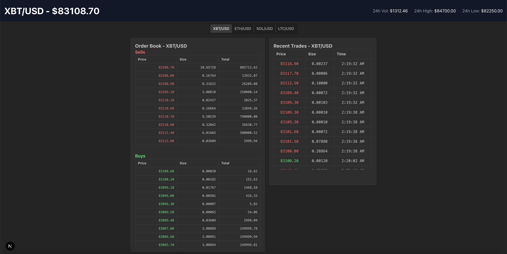

# Real-Time Crypto Order Book



A real-time cryptocurrency order book application built with Next.js, showcasing live market data from Kraken's WebSocket API. The application displays real-time order book updates, trade feeds, and market information for various cryptocurrency pairs.

## Vercel Application
https://dex-order-book.vercel.app/

## Features

- Real-time order book updates via WebSocket connection
- Live trade feed with recent transactions
- Multiple market pair support (BTC/USD, ETH/USD, SOL/USD, LTC/USD)
- Responsive and modern UI design
- Automatic reconnection handling with exponential backoff
- Tab visibility management for optimal performance
- Rate limiting for WebSocket connections
- Throttled updates to prevent UI flooding

## Tech Stack

- **Framework**: Next.js 14 with App Router
- **Language**: TypeScript
- **Styling**: Tailwind CSS
- **State Management**: React Hooks
- **WebSocket**: Native WebSocket API
- **API Integration**: Kraken WebSocket API
- **Performance**: Lodash throttling

## Getting Started

1. Clone the repository:
```bash
git clone <repository-url>
cd order-book
```

2. Install dependencies:
```bash
npm install
# or
yarn install
# or
pnpm install
```

3. Run the development server:
```bash
npm run dev
# or
yarn dev
# or
pnpm dev
```

4. Open [http://localhost:3000](http://localhost:3000) in your browser.

## Project Structure

```
order-book/
├── app/
│   ├── api/           # API routes
│   ├── layout.tsx     # Root layout
│   ├── page.tsx       # Main page
│   └── globals.css    # Global styles
├── components/
│   ├── AppContent.tsx      # Main app container
│   ├── MarketSelector.tsx  # Market pair selector
│   ├── OrderBook.tsx       # Order book display
│   ├── PriceHeader.tsx     # Price information header
│   └── TradeFeed.tsx       # Real-time trade feed
└── hooks/
    ├── useOrderBook.ts     # Order book WebSocket logic
    └── useKrakenTrades.ts  # Trade feed WebSocket logic
```

## Features in Detail

### Order Book
- Real-time updates of bid and ask orders
- Configurable depth display
- Price and volume information
- Automatic sorting and updates

### WebSocket Connection Management
- Automatic reconnection with exponential backoff
- Connection rate limiting
- Tab visibility optimization
- Graceful error handling

### Market Selection
- Easy switching between different market pairs
- Maintains separate connections per market
- Smooth transition between markets

## Configuration

Key configuration constants can be found in the WebSocket hooks:

```typescript
const DEPTH = 10                      // Order book depth
const THROTTLE_MS = 100               // Update throttle time
const MAX_RETRIES = 5                 // Maximum reconnection attempts
const CONNECTION_TIMEOUT = 5000        // Connection timeout (ms)
const RATE_LIMIT_WINDOW = 1000        // Rate limiting window (ms)
```

## Error Handling

The application implements robust error handling:
- WebSocket connection failures
- Network status monitoring
- Invalid data handling
- Rate limiting
- Automatic reconnection

## Contributing

1. Fork the repository
2. Create your feature branch (`git checkout -b feature/amazing-feature`)
3. Commit your changes (`git commit -m 'Add some amazing feature'`)
4. Push to the branch (`git push origin feature/amazing-feature`)
5. Open a Pull Request

## License

This project is licensed under the MIT License - see the LICENSE file for details.
